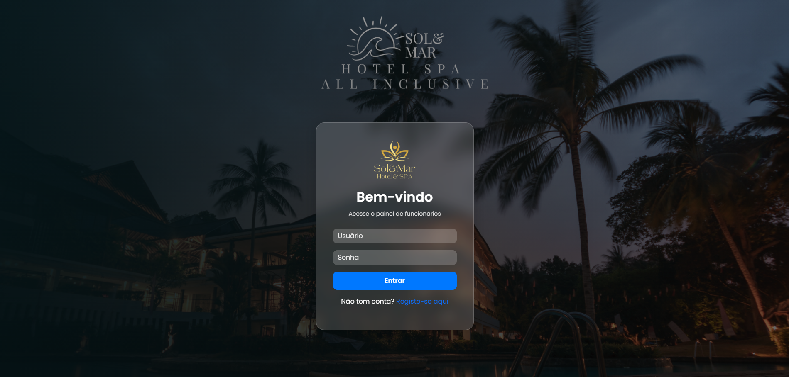

🏨 Projeto Hotel Sol&Mar

Sistema de gestão para o Hotel Sol&Mar, desenvolvido em PHP com MySQL e integração de envio de emails via PHPMailer. Permite gerenciar funcionários, clientes e reservas de forma prática e segura, com autenticação tradicional e via Google OAuth.

🚀 Funcionalidades

Cadastro e login de funcionários

Login tradicional (usuário/senha)

Login com Google OAuth

Envio de email de boas-vindas após cadastro

Gerenciamento de reservas

Criar, editar e excluir reservas

Visualização de reservas por status e datas

Gerenciamento de clientes

Cadastro, atualização e exclusão de clientes/contatos

Dashboard administrativo

Total de clientes e reservas

Ações rápidas: adicionar cliente e criar nova reserva

Envio de emails

Email de boas-vindas

Notificações de reservas

Segurança

Senhas armazenadas de forma hash segura

Controle de acesso baseado em sessões

Responsividade

Layout adaptável a desktop, tablet e smartphone com Bootstrap 5

🛠 Tecnologias Utilizadas

PHP 8+ – Back-end

MySQL / MariaDB – Banco de dados relacional

PHPMailer – Envio de emails

Bootstrap 5 – Estilização e responsividade

Google OAuth – Login via Google

HTML5, CSS3, JavaScript – Interface e interação

📂 Estrutura do Projeto
/HotelSolMar
│
├─ index.php            # Dashboard principal
├─ clientes.php         # Lista e gerenciamento de clientes
├─ reservas.php         # Lista e gerenciamento de reservas
├─ createform.php       # Adicionar cliente
├─ updateform.php       # Editar cliente
├─ nova_reserva.php     # Criar reserva
├─ login.php            # Login de funcionários
├─ logout.php           # Logout
├─ registo.php          # Registro de novos funcionários
├─ connection.php       # Conexão com banco de dados
├─ email.php            # Funções de envio de email
└─ crud/                # Operações de leitura, edição e exclusão

⚙️ Configuração

Clonar o repositório no servidor local ou remoto:

git clone <URL_DO_REPOSITORIO>

Criar banco de dados HotelDB e importar as tabelas.

Configurar connection.php com usuário e senha do MySQL.

Configurar PHPMailer (email.php) para envio de emails.

(Opcional) Configurar credenciais do Google OAuth para login via Google.

🌟 Melhorias Futuras

Integração com pagamento online para reservas

Dashboard com gráficos de ocupação e faturamento

Sistema de relatórios em PDF

Filtragem avançada de reservas e clientes

Perfis de usuário com permissões diferenciadas

📧 Contato

Desenvolvido por Suzyany

🇪🇸 Español
🏨 Proyecto Hotel Sol&Mar

Sistema de gestión para el Hotel Sol&Mar, desarrollado en PHP con MySQL e integración de envío de correos electrónicos mediante PHPMailer. Permite gestionar empleados, clientes y reservas de forma práctica y segura, con autenticación tradicional y vía Google OAuth.

🚀 Funcionalidades

Registro e inicio de sesión de empleados

Login tradicional (usuario/contraseña)

Login con Google OAuth

Envío de correo de bienvenida tras el registro

Gestión de reservas

Crear, editar y eliminar reservas

Visualización de reservas por estado y fecha

Gestión de clientes

Crear, actualizar y eliminar clientes/contactos

Panel administrativo

Total de clientes y reservas

Acciones rápidas: agregar cliente y crear nueva reserva

Envío de correos electrónicos

Correo de bienvenida

Notificaciones de reservas

Seguridad

Contraseñas almacenadas de forma hash segura

Control de acceso basado en sesiones

Responsividad

Diseño adaptativo para escritorio, tablet y móvil con Bootstrap 5

🛠 Tecnologías Utilizadas

PHP 8+ – Back-end

MySQL / MariaDB – Base de datos

PHPMailer – Envío de correos

Bootstrap 5 – Estilos y responsividad

Google OAuth – Inicio de sesión mediante Google

HTML5, CSS3, JavaScript – Interfaz e interactividad

📂 Estructura del Proyecto
/HotelSolMar
│
├─ index.php            # Panel principal
├─ clientes.php         # Lista y gestión de clientes
├─ reservas.php         # Lista y gestión de reservas
├─ createform.php       # Agregar cliente
├─ updateform.php       # Editar cliente
├─ nova_reserva.php     # Crear reserva
├─ login.php            # Inicio de sesión de empleados
├─ logout.php           # Cerrar sesión
├─ registo.php          # Registro de nuevos empleados
├─ connection.php       # Conexión a la base de datos
├─ email.php            # Funciones de envío de correo
└─ crud/                # Operaciones de lectura, edición y eliminación

⚙️ Configuración

Clonar el repositorio:

git clone <URL_DEL_REPOSITORIO>

Crear la base de datos HotelDB e importar las tablas.

Configurar connection.php con usuario y contraseña de MySQL.

Configurar PHPMailer (email.php) para envío de correos.

(Opcional) Configurar credenciales de Google OAuth para login vía Google.

🌟 Mejoras Futuras

Integración con pagos online para reservas

Panel con gráficos de ocupación e ingresos

Sistema de reportes en PDF

Filtrado avanzado de reservas y clientes

Perfiles de usuario con permisos diferenciados

📧 Contacto

Desarrollado por Suzyany

 English
🏨 Hotel Sol&Mar Project

Management system for Hotel Sol&Mar, developed in PHP with MySQL and email sending integration via PHPMailer. Allows practical and secure management of employees, clients, and reservations, with both traditional and Google OAuth login options.

🚀 Features

Employee registration and login

Traditional login (username/password)

Login with Google OAuth

Welcome email sent upon registration

Reservation management

Create, edit, and delete reservations

View reservations by status and date

Client management

Add, update, and delete clients/contacts

Admin dashboard

Total clients and reservations

Quick actions: add client and create new reservation

Email notifications

Welcome email

Reservation notifications

Security

Passwords stored securely with hashing

Session-based access control

Responsive design

Layout adapts to desktop, tablet, and mobile using Bootstrap 5

🛠 Technologies Used

PHP 8+ – Backend

MySQL / MariaDB – Database

PHPMailer – Email sending

Bootstrap 5 – Styling and responsiveness

Google OAuth – Google login

HTML5, CSS3, JavaScript – Interface and interactivity

📂 Project Structure
/HotelSolMar
│
├─ index.php            # Main dashboard
├─ clientes.php         # Client list and management
├─ reservas.php         # Reservation list and management
├─ createform.php       # Add client
├─ updateform.php       # Edit client
├─ nova_reserva.php     # Create reservation
├─ login.php            # Employee login
├─ logout.php           # Logout
├─ registo.php          # Register new employees
├─ connection.php       # Database connection
├─ email.php            # Email functions
└─ crud/                # CRUD operations

⚙️ Setup

Clone the repository:

git clone <REPO_URL>

Create the HotelDB database and import the tables.

Configure connection.php with your MySQL user and password.

Configure PHPMailer (email.php) for sending emails.

(Optional) Configure Google OAuth credentials for Google login.

🌟 Future Improvements

Online payment integration for reservations

Dashboard with occupancy and revenue charts

PDF report generation

Advanced filtering for reservations and clients

User profiles with role-based permissions

📧 Contact

Developed by Suzyany
